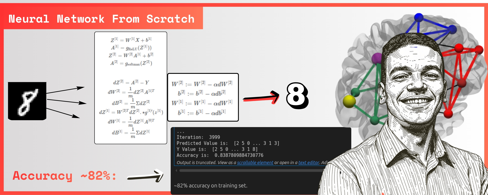
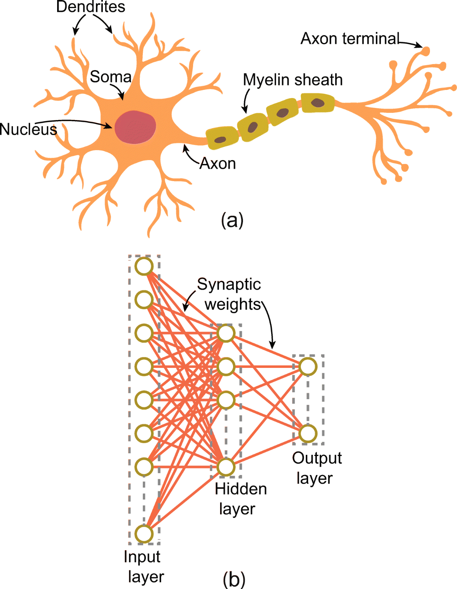
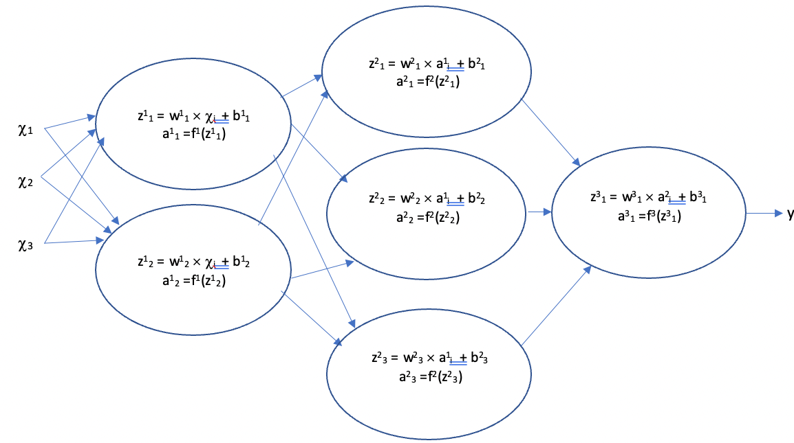
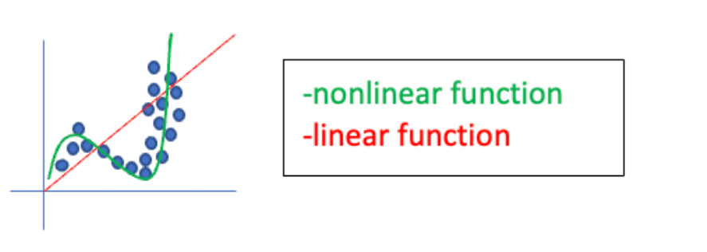
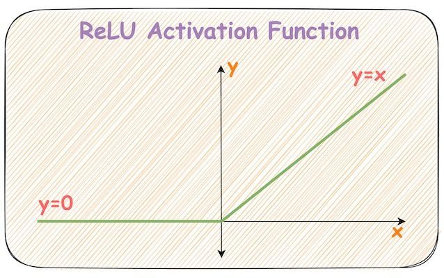
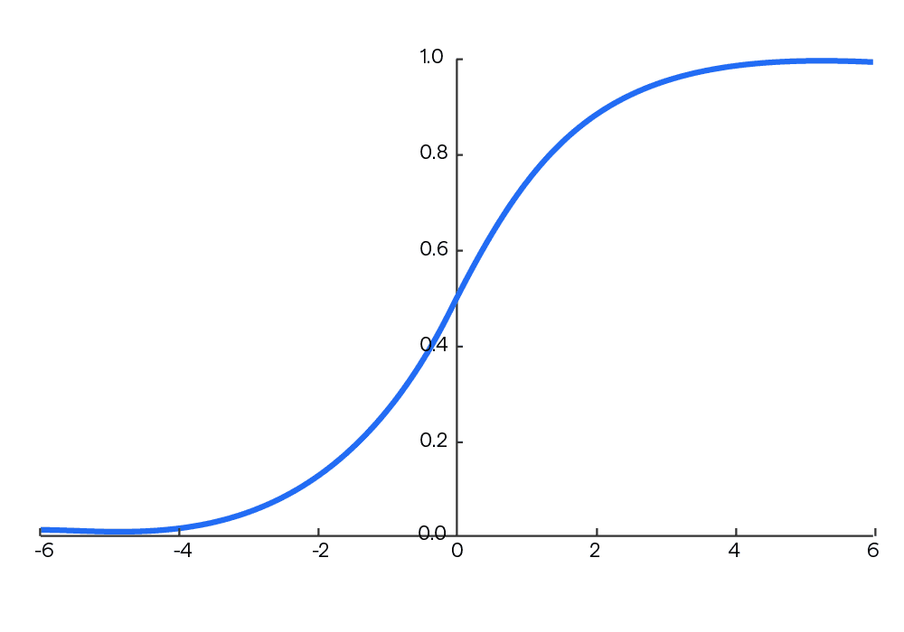
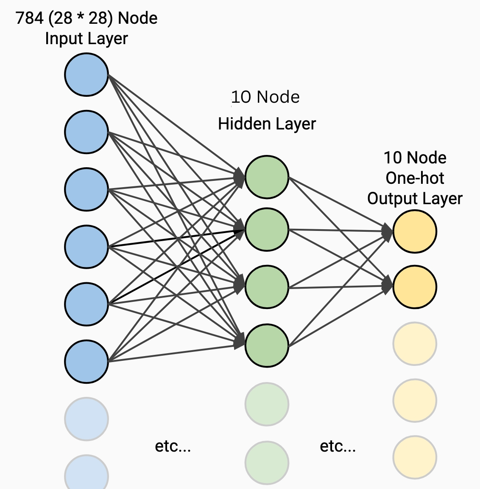

# Neural Network from Scratch

> Yeah, you read that right. I'm doing this from scratch. In this documentation, I'm going to build a tiny neural network in pure Python — no libraries, no shortcuts, no TensorFlow, no PyTorch. **Just me and math.**

---

## Prerequisites

Before we start, you should know:

- The basics of what a neural network is (layers, weights, biases, activation functions)
- Some Python experience helps, but I'll explain things as we go

---

## Table of Contents

1. [Neural Network Architecture](#1-neural-network-architecture)
2. [Some Important Concepts](#2-some-important-concepts)
3. [Our Case with the MNIST Dataset](#3-our-case-with-the-mnist-dataset)
4. [Coding Part](#4-coding-part)

---

## 1. Neural Network Architecture

A neural network is a model that tries to simulate how the human brain works. In the human brain, we have something called a **neuron**.

> **By the way** — a neuron is a complex function that can learn new patterns.

This network contains three layers:

| Layer | Role |
|---|---|
| **Input Layer** | Accepts the raw inputs (numbers, images, audio) |
| **Hidden Layer** | Learns patterns from the data |
| **Output Layer** | Produces the prediction (e.g. temperature) or classification (e.g. cat/dog) |

### The Three Layers Explained

**Input Layer**
The layer that accepts inputs — for example, temperature, image, or audio. All inputs are represented as numbers.

**Hidden Layer**
The layer that learns from the data.

**Output Layer**
The output depends on what we want to predict. For example:
- Is this a cat or a dog?
- Is this email spam or not?

---

## 2. Some Important Concepts

### How Many Neurons in Each Layer?

**Input Layer**

It depends on the inputs. If it's an image, the number of neurons equals the image resolution — for example, 28 × 28 = 784 neurons.

**Hidden Layer**

There's no strict rule here, but keep this in mind:

> More hidden layers is generally better than more neurons in a single hidden layer. As a rule of thumb, 1–2 layers solve most common problems.

**Output Layer**

It depends on what we want to output. For example, if we're classifying 10 digits (0–9), we need 10 output neurons.

---

### Activation Functions

Activation functions are necessary to prevent linearity. Without them, data would pass through the layers only through linear functions of the form $a \cdot x + b$. The composition of linear functions is still linear, so no matter how many layers the data goes through, the output would always be a linear function — which severely limits what the network can learn.

An example showing the benefits of nonlinear functions for fitting data models:

> Source: https://towardsdatascience.com/the-importance-and-reasoning-behind-activation-functions-4dc00e74db41/

---

#### ReLU — Activation Function

For the hidden layer, we use **ReLU (Rectified Linear Unit)**:

$$f(x) = \max(0, x)$$

**How it works:**

| Condition | Output |
|---|---|
| $x > 0$ | $f(x) = x$ |
| $x \leq 0$ | $f(x) = 0$ |

Simple idea: if the value is negative, kill it (return 0). If it's positive, keep it (return it as-is).

---

#### Softmax — Activation Function

For the output layer, we use **Softmax**:

$$\text{Softmax}(x_i) = \frac{e^{x_i}}{\sum_{j} e^{x_j}}$$

Softmax turns the output into **probabilities** — every output value is between 0 and 1, and they all add up to 1. This makes it perfect for classification tasks.

> **Note:** We apply **ReLU** to each neuron in the hidden layer, and **Softmax** to each neuron in the output layer.

---

### Cross-Entropy Loss Function

The cross-entropy loss function measures how close a model's predictions are to the correct answers in **classification** problems.

Depending on the problem, there are different types of cross-entropy:

#### Binary Cross-Entropy Loss

Used in binary classification problems. For a dataset with $N$ instances:

$$\text{BCE} = -\frac{1}{N} \sum_{i=1}^{N} \left( y_i \cdot \log(p_i) + (1 - y_i) \cdot \log(1 - p_i) \right)$$

#### Multiclass Cross-Entropy Loss

Also known as categorical cross-entropy or softmax loss. Used for multiclass classification problems. For a dataset with $N$ instances and $C$ classes:

$$\text{CE} = -\frac{1}{N} \sum_{i=1}^{N} \sum_{j=1}^{C} y_{i,j} \cdot \log(p_{i,j})$$

#### Where:

| Symbol | Meaning |
|--------|---------|
| $N$ | Number of samples |
| $C$ | Number of classes |
| $y_{i,j}$ | 1 if class $j$ is the correct label for sample $i$, otherwise 0 |
| $p_{i,j}$ | Model-predicted probability that sample $i$ belongs to class $j$ |

> In the forward pass, we use this function to evaluate the model's predictions and calculate accuracy.

**Good resource:** https://www.geeksforgeeks.org/machine-learning/what-is-cross-entropy-loss-function/

---

## 3. Our Case with the MNIST Dataset

MNIST is a dataset containing 28×28 pixel images (784 features). Our goal is to build a model that accepts an image as input and classifies which digit it represents (0 through 9). This is a classification problem with 10 classes.

### Neuron Architecture

As shown in the architecture diagram:
- **Input Layer**: 784 neurons (one per pixel, since 28 × 28 = 784)
- **Hidden Layer**: 10 neurons (chosen arbitrarily)
- **Output Layer**: 10 neurons (one per digit class, 0–9)

---

### Forward Propagation

Forward propagation is the process where we compute activations layer by layer using the current weights and biases. These values are later used in backward propagation to update the network's parameters.

Let's look at the dimensions of the weights and biases in each layer:

**Input Layer**

$$A^{[0]} = X \quad \text{Shape: } (784 \times m)$$

**Layer 1 (Hidden Layer)**

$$Z^{[1]} = W^{[1]} A^{[0]} + b^{[1]} \quad \text{Shape: } (10 \times m)$$

$$A^{[1]} = g(Z^{[1]}) \quad \text{Shape: } (10 \times m)$$

$$W^{[1]} \text{ Shape: } (10 \times 784), \quad b^{[1]} \text{ Shape: } (10 \times 1)$$

**Layer 2 (Output Layer)**

$$Z^{[2]} = W^{[2]} A^{[1]} + b^{[2]} \quad \text{Shape: } (10 \times m)$$

$$A^{[2]} = g(Z^{[2]}) \quad \text{Shape: } (10 \times m)$$

$$W^{[2]} \text{ Shape: } (10 \times 10), \quad b^{[2]} \text{ Shape: } (10 \times 1)$$

---

### Backward Propagation

After forward propagation, we measure the error using the multiclass cross-entropy loss function. Here are the formulas used to update the weights and biases:

**Layer 2 (Output Layer Gradients)**

$$dZ^{[2]} = A^{[2]} - Y$$

$$dW^{[2]} = \frac{1}{m} \, dZ^{[2]} \, A^{[1]T}$$

$$db^{[2]} = \frac{1}{m} \sum dZ^{[2]}$$

**Layer 1 (Hidden Layer Gradients)**

$$dZ^{[1]} = W^{[2]T} \, dZ^{[2]} \cdot g'^{[1]}(Z^{[1]})$$

$$dW^{[1]} = \frac{1}{m} \, dZ^{[1]} \, A^{[0]T}$$

$$db^{[1]} = \frac{1}{m} \sum dZ^{[1]}$$

> **Note:** These formulas are derived from gradient descent. You can derive them yourself using the chain rule.

---

### Update Parameters

After computing gradients, we update the parameters using gradient descent:

**Layer 2**

$$W^{[2]} := W^{[2]} - \alpha \, dW^{[2]}$$

$$b^{[2]} := b^{[2]} - \alpha \, db^{[2]}$$

**Layer 1**

$$W^{[1]} := W^{[1]} - \alpha \, dW^{[1]}$$

$$b^{[1]} := b^{[1]} - \alpha \, db^{[1]}$$

---

## 4. Coding Part

### Function Overview

| Function | Purpose | Input | Output |
|----------|---------|-------|--------|
| `init_param()` | Initializes weights and biases randomly | None | `W_1, B_1, W_2, B_2` |
| `ReLU(Z)` | Applies ReLU activation (sets negative values to 0) | `Z` | Activated matrix |
| `softmax(Z)` | Converts raw scores into a probability distribution | `Z` | Probability matrix |
| `forward_prop(W_1, B_1, W_2, B_2, X)` | Performs forward propagation through the network | Weights, biases, input `X` | `Z_1, A_1, Z_2, A_2` |
| `one_hot_encode(Y)` | Converts labels into one-hot encoded vectors | Labels `Y` | One-hot matrix |
| `ReLU_deriv(Z)` | Computes the derivative of ReLU for backpropagation | `Z` | Gradient mask (0 or 1) |
| `backward_prop(Z_1, A_1, Z_2, A_2, W_1, W_2, X, Y)` | Computes gradients using backpropagation | Forward cache + weights + input + labels | `dW_1, dB_1, dW_2, dB_2` |
| `update_params(W_1, W_2, B_1, B_2, dW_1, dW_2, dB_1, dB_2, alpha)` | Updates parameters using gradient descent | Weights, biases, gradients, learning rate | Updated `W_1, B_1, W_2, B_2` |

---

### Training Pipeline

| Step | Process |
|------|---------|
| 1 | Initialize parameters (`init_param`) |
| 2 | Forward propagation (`forward_prop`) |
| 3 | Compute loss |
| 4 | Backward propagation (`backward_prop`) |
| 5 | Update parameters (`update_params`) |
| 6 | Repeat for multiple iterations |

---

## Contributing

If you find anything in this documentation that is unclear or incorrect, feel free to contribute. You're also welcome to use this model and deploy it!