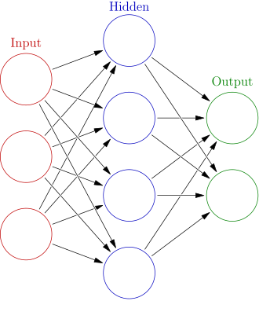

# Neural Network from Scratch

> Yeah, you read that right. I do this from scratch. In this documentation, I'm going to build a tiny neural network in pure Python. No libraries. No shortcuts. No TensorFlow. No PyTorch. **Just me and math.**

---

## Prerequisites

Before we start, you should know:

- The basics of what a neural network is (layers, weights, biases, activation functions)
- Some Python experience helps, but I'll explain things as we go

---

## Table of Contents

1. [Neural Network Architecture](#neural-network-architecture)
2. [Some Important Concepts](#some-important-concepts)
3. [Our Case with the MNIST Dataset](#our-case-with-the-mnist-dataset)
4. [Full Code Listing](#full-code-listing)
5. [Building and Running](#building-and-running)

---

## 1. Neural Network Architecture

A neural network is a model that tries to simulate how the human brain works. In the human brain, we have something called a **neuron**.

> **By the way** — a neuron is a COMPLEX FUNCTION. This function can learn new patterns.

This network contains three layers:

| Layer | Role |
|---|---|
| **Input Layer** | Accepts the raw inputs (numbers, images, audio) |
| **Hidden Layer** | Learns patterns from the data |
| **Output Layer** | Produces the prediction or classification |


### The Three Layers Explained

**Input Layer**
The layer that accepts inputs — for example, temperature, image, or audio. But all these inputs are numbers.

**Hidden Layer**
The layer that learns from the data.

**Output Layer**
The output depends on what we want to predict. For example:
- Is this a cat or a dog?
- Is this email spam or not?

---

## 2. Some Important Concepts

### How many neurons in each layer?

**Input Layer**

It depends on the inputs. If it's an image, the number of neurons equals the image resolution — for example, 28 × 28 = 784 neurons.

**Hidden Layer**

There's no strict rule here, but keep this in mind:

> More hidden layers is better than more neurons in one hidden layer. That said, 1–2 layers solve most common problems.

**Output Layer**

It depends on what we want to output. For example, if we're classifying 10 digits (0–9), we need 10 output neurons.

### Our Architecture

For this project, we're going to use:

```
Input Layer  →  Hidden Layer  →  Output Layer
```



---

### Activation Functions

In the hidden layer, we use an **activation function** — a function that breaks the linearity of our model. Without it, our model is just a simple linear regression:

$$
Y = AX + B
$$

We need activation functions to learn complex, non-linear patterns.

---

#### ReLU — Hidden Layer

For the hidden layer, we use **ReLU (Rectified Linear Unit)**:

$$
f(x) = \max(0, x)
$$


**How it works:**

| Condition | Output |
|---|---|
| x > 0 | f(x) = x |
| x ≤ 0 | f(x) = 0 |

Simple idea: if the value is negative, kill it. If it's positive, keep it.

---

#### Softmax — Output Layer

For the output layer, we use **Softmax**:

$$
\text{Softmax}(x_i) = \frac{e^{x_i}}{\sum_{j} e^{x_j}}
$$


Softmax turns the output into **probabilities** — every output value is between 0 and 1, and they all add up to 1. This makes it perfect for classification.

---

> **NOTE:** We apply **ReLU** to each neuron in the hidden layer, and **Softmax** to each neuron in the output layer.

---